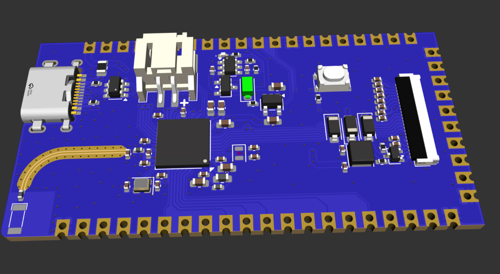
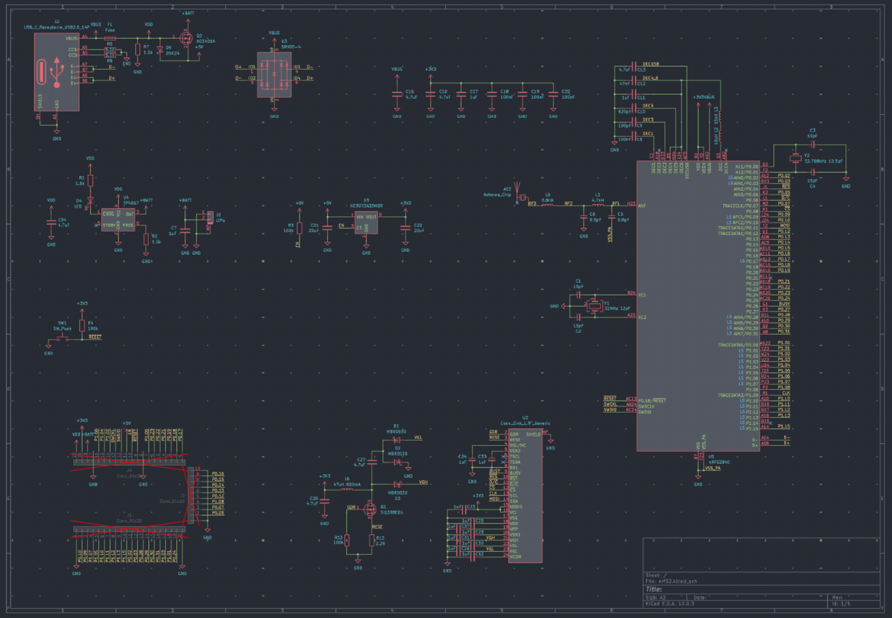
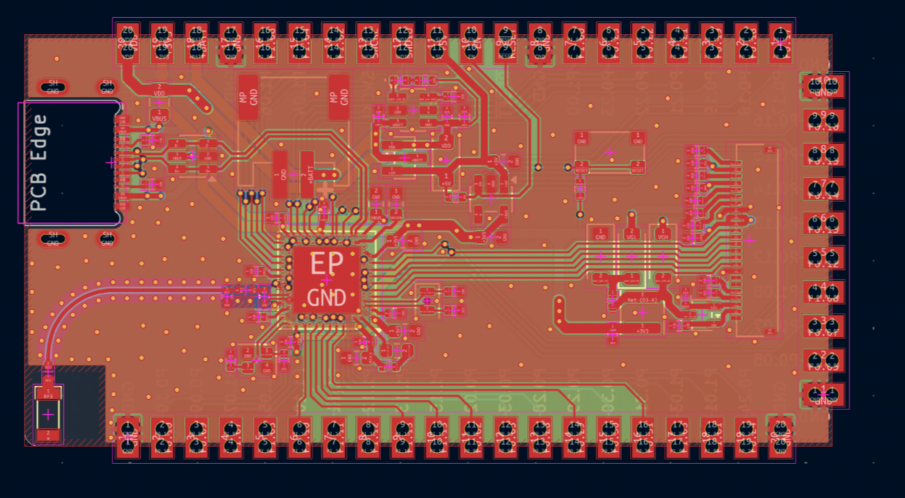

# n52 stamp

nRF52 stamp devboard with castellated holes on all 3 edges and a low profile,
allowing it to be easily soldered onto a carrier board, without having to deal with
the aQFN nRF52840 footprint. The board breaks out 36 I/O pins, and also has an
embedded 24 pin e-ink connector.

The board can operate standalone for direct wireless communication with host devices, or function as a carrier board for more complex projects. Key features include low current consumption, easy usability, and a streamlined design that prioritizes rapid prototyping and deployment.

The board's 36 broken-out I/O pins provide extensive flexibility for sensor integration, peripheral control, and data communication.

Features:
- Integrated power path
- LiPo charger
- Eink driver
- Low current consumption
- Easy to use
- Castellated edges

The board uses a nrf52 design to allow for bluetooth communication, and has all that is needed to directly communicate via bluetooth to a host. No external parts needed, but it can also act as an carrier board

Pins:
* LED0 = P0.18
* LED1 = P0.17
* E-Ink
  * BUSY   = P0.26
  * nRESET = P0.04
  * nD/C   = P0.06
  * nCS    = P0.08
  * CLK    = P1.09
  * MOSI   = P0.11

The best way to program the board and use it is to use [Zephyr](https://docs.zephyrproject.org/)

All sources are present in the repo

| Item | Cost | Where |
| ---- | ---- | ----- |
| PCB + PCBA | $160 | JLC |
